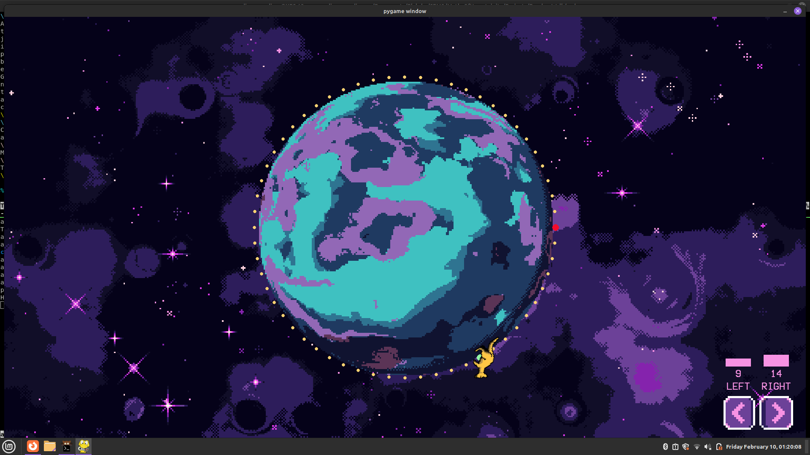
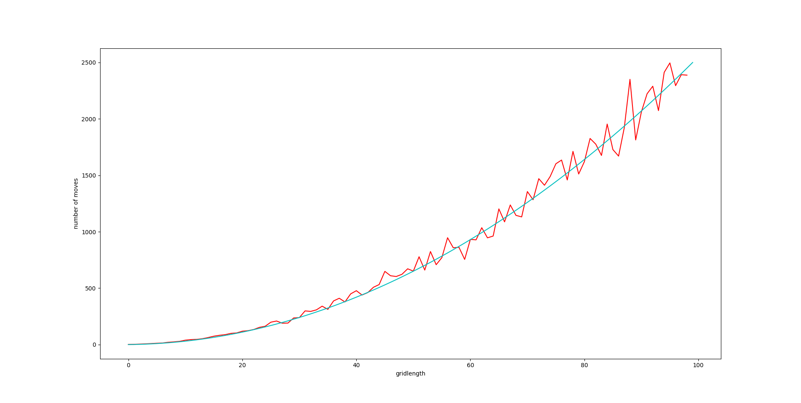
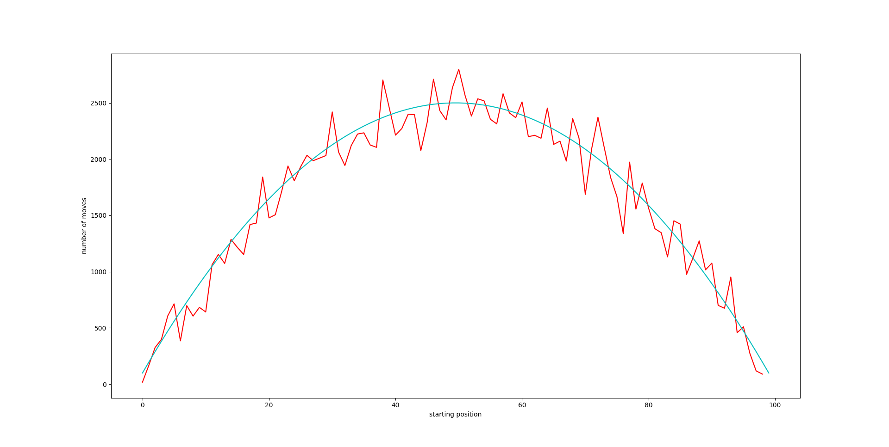

# Random Walk
This was a project which was based on data collection regarding random walk, including calculating the homgenous and non-homogenous recurrence relationship pertaining to the number of steps taken by the kangaroo and the probability of it reaching the end

the data collected was as follows

where `cyan` shows us the calculated position, and `red` shows us the average of `100` runs of the random-walk
